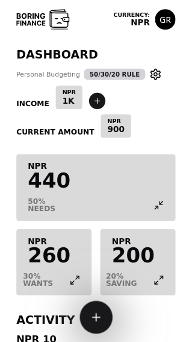
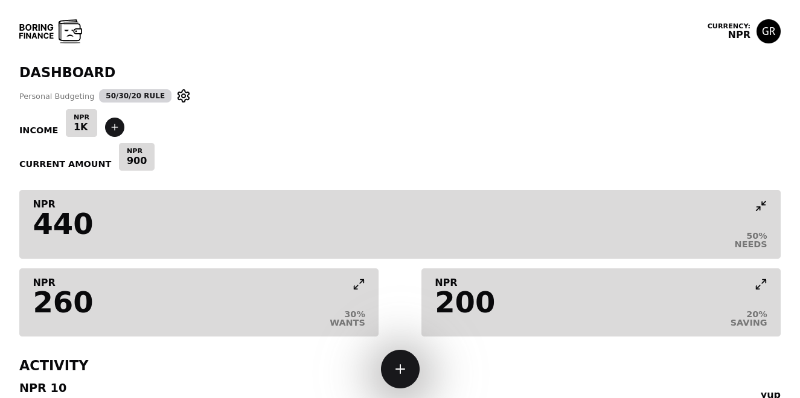

 

  

  <h3 align="center">Boring Finance: Fancy Record Keeping</h3>

  

  A minimalist and modular finance tracking web application that implements the 50-30-20 budgeting rule
  

  

    <a href="https://boring-finance.vercel.app">Use Web App</a>
    -
    <a href="https://github.com/Grace-Rasaily/boringfinance/issues/new?labels=bug&template=bug-report---.md">Report Bug</a>
  

 

  
Table of Contents

  <ol>
    <li>
      <a href="#about-the-project">About The Project</a>
      <ul>
        <li><a href="#built-with">Built With</a></li>
      </ul>
    </li>
    <li><a href="#usage">Usage</a></li>
    <li><a href="#roadmap">Roadmap</a></li>
    <li><a href="#contributing">Contributing</a></li>
    <li><a href="#license">License</a></li>
    <li><a href="#contact">Contact</a></li>
    <li><a href="#acknowledgments">Acknowledgments</a></li>
  </ol>

## About The Project

Boring Finance is a minimalist and modular finance tracking web application designed to simplify budgeting using the 50-30-20 rule. The project aims to provide a clean, intuitive interface for users to manage their finances effectively while offering flexibility for future enhancements.

Key features:
* Dashboard showing total budget breakdown (50/30/20 allocation)
* Activity feed for tracking transactions
* Transaction entry and management
* Settings for budget customization

The 50-30-20 rule is a simple budgeting method that allocates:
* 50% of income to needs
* 30% to wants
* 20% to savings

This application helps users visualize and maintain this allocation easily.

(<a href="#readme-top">back to top</a>)

### Modularity

Boring Finance aims to achieve a modular architecture, allowing for:

1. Easy addition of new features and components
2. Flexibility in customizing existing modules
3. Potential for users to enable/disable specific features
4. Simplified maintenance and updates
5. Possibility of third-party module development in the future

This modular approach ensures that Boring Finance can evolve with user needs and adapt to various financial management strategies beyond the initial 50-30-20 rule implementation.

(<a href="#readme-top">back to top</a>)

### Built With

This section should list any major frameworks/libraries used to bootstrap your project. Leave any add-ons/plugins for the acknowledgements section. Here are a few examples.

* React.js
* Elysia.js
* Bun
* Shadcn UI
* MongoDB

(<a href="#readme-top">back to top</a>)

## Roadmap

- [ ] Category-based expense tracking
- [ ] Multiple currency support
- [ ] Modular architecture for easy expansion and customization

See the [open issues](https://github.com/Grace-Rasaily780/boringfinance/issues) for a full list of proposed features (and known issues).

(<a href="#readme-top">back to top</a>)

## Contributing

Contributions are what make the open source community such an amazing place to learn, inspire, and create. Any contributions you make are **greatly appreciated**.

If you have a suggestion that would make this better, please fork the repo and create a pull request. You can also simply open an issue with the tag "enhancement".
Don't forget to give the project a star! Thanks again!

1. Fork the Project
2. Create your Feature Branch (`git checkout -b feature/AmazingFeature`)
3. Commit your Changes (`git commit -m 'Add some AmazingFeature'`)
4. Push to the Branch (`git push origin feature/AmazingFeature`)
5. Open a Pull Request

### Top contributors:

(<a href="#readme-top">back to top</a>)

## License

Distributed under the GLP-3.0 License. See `LICENSE.txt` for more information.

(<a href="#readme-top">back to top</a>)

## Contact

Grace Rasaily - [@GraceRasaily](https://www.linkedin.com/in/grace-rasaily-a53263206/) - rasailygrace56@gmail.com

Project Link: [https://github.com/Grace-Rasaily780/boringfinance](https://github.com/Grace-Rasaily/boringfinance)

(<a href="#readme-top">back to top</a>)

## Acknowledgments

* [Shadcn UI](https://ui.shadcn.com)
* [Currency Code API](https://github.com/carlosvin/currencies-map)
* [Zustand](https://zustand-demo.pmnd.rs)
* [Best-README-Template](https://github.com/othneildrew/Best-README-Template)

(<a href="#readme-top">back to top</a>)

